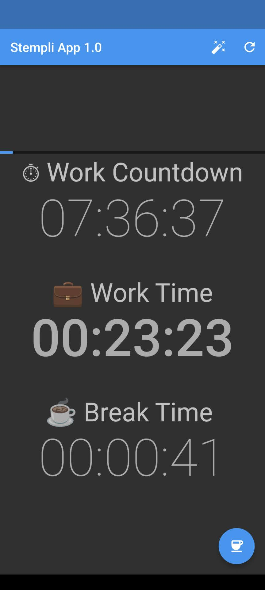
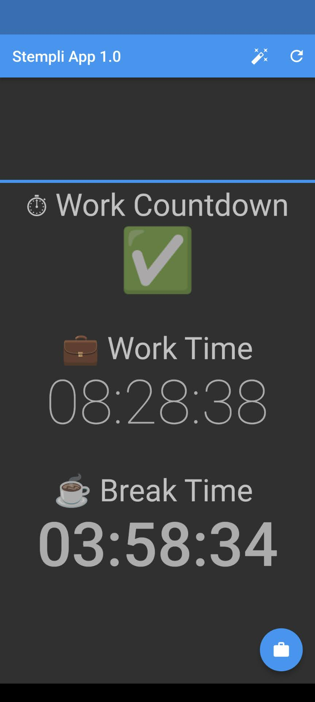

# Stempli Flutter App

Stempli is an app to track your daily work time and break time easily.

## Screenshots

Work Time | Break Time
:-:|:-:
 | 

## Features

- track work + break time
- magic button to adjust both
- set custom daily work time
- set custom timer adjust interval
- toggle display seconds
- toggle display countdown
- toggle dark mode
- material 3 design
- works always offline
- no data sharing

## TODO

- fix ios design
- set different daily work times
- add locale
- toggle timer via notification

## Tested Versions

- ✅ [Android](https://github.com/mirkoole/Stempli-Flutter-App/releases/download/v1.2.2/app-release.apk)
- ✅ iOS
- ✅ [Web](https://mirkoole.github.io/Stempli-Flutter-App/)
