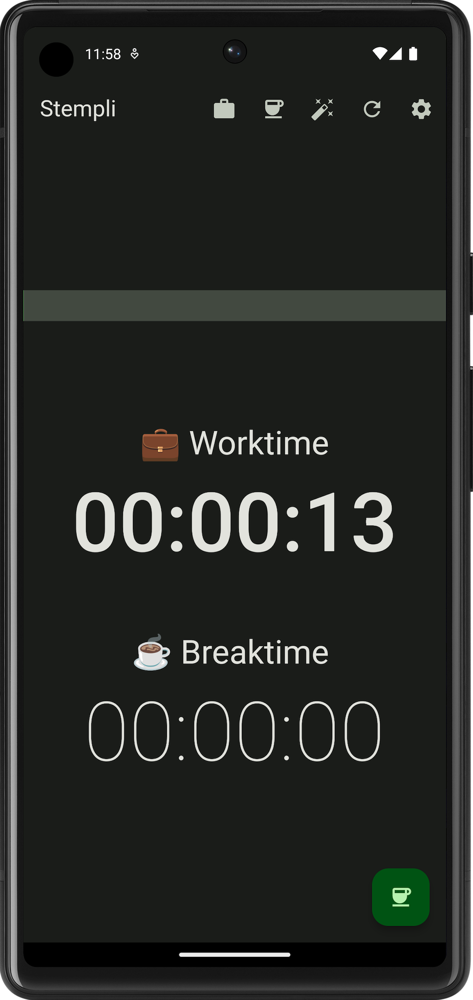
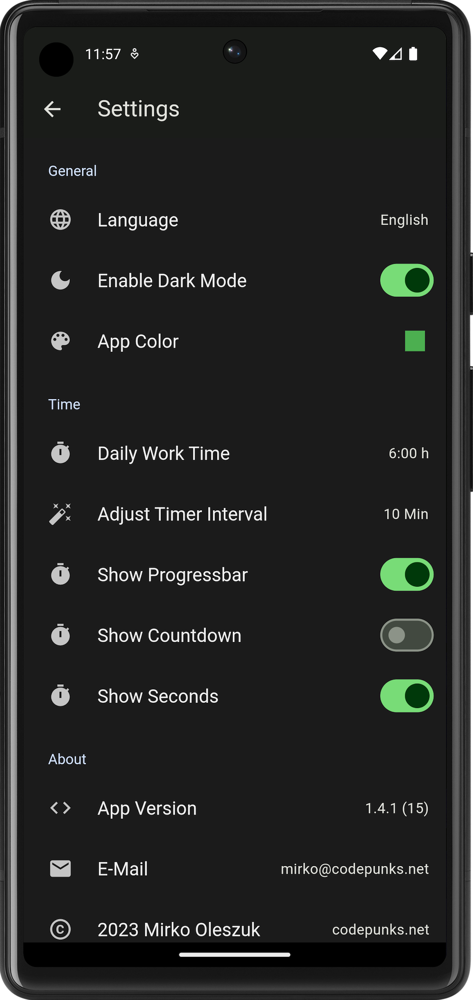

# Stempli Flutter App

Stempli is an app to track your daily work time and break time easily.

## Screenshots

Work Time | Break Time | Settings
:-:|:-:|:-:
 |  | 

## Features

- track work + break time
- magic buttons to adjust both
- works always offline
- no data sharing with anyone
- set custom daily work times
- set custom timer adjust interval
- toggle display seconds
- toggle display countdown
- toggle dark mode
- material 3 design

## Last Changes

- add duration picker on settings page
- add toggle for different daily worktimes
- refactoring settings menu

## TODO

### History
- add history (button to store daily worktime)
- edit history
- delete history after certain time

### Misc
- add translations
- toggle timer via notification
- add wear os compatibility
- idea: add animation (e.g. fireworks)
- idea: rethink button layout (stop, pause, reset)
- bug: update pwa icon

## Download

- [Android-App APK](https://github.com/mirkoole/Stempli-Flutter-App/releases/)
- [Android-App via Google Play Store](https://play.google.com/store/apps/details?id=net.codepunks.stempli)
- or [Open Web-App](https://mirkoole.github.io/Stempli-Flutter-App/)
